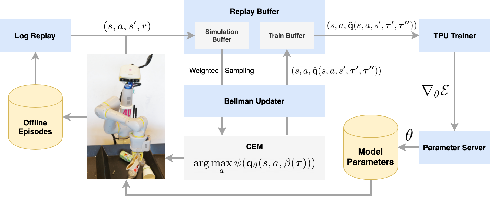
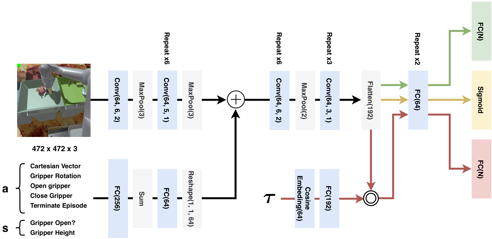
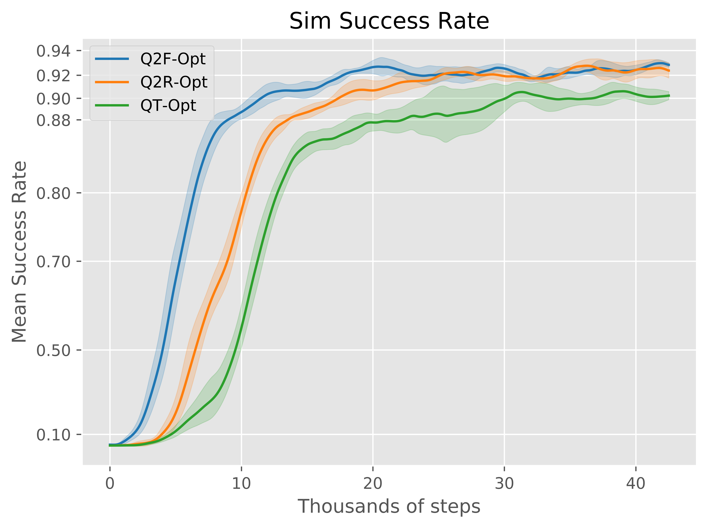
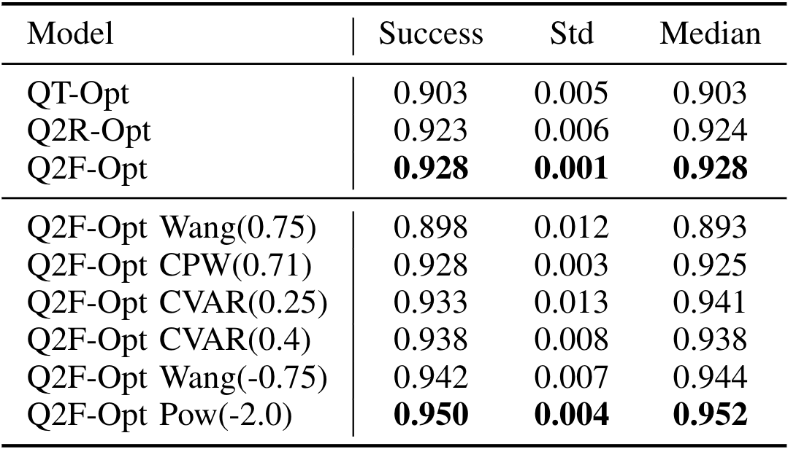
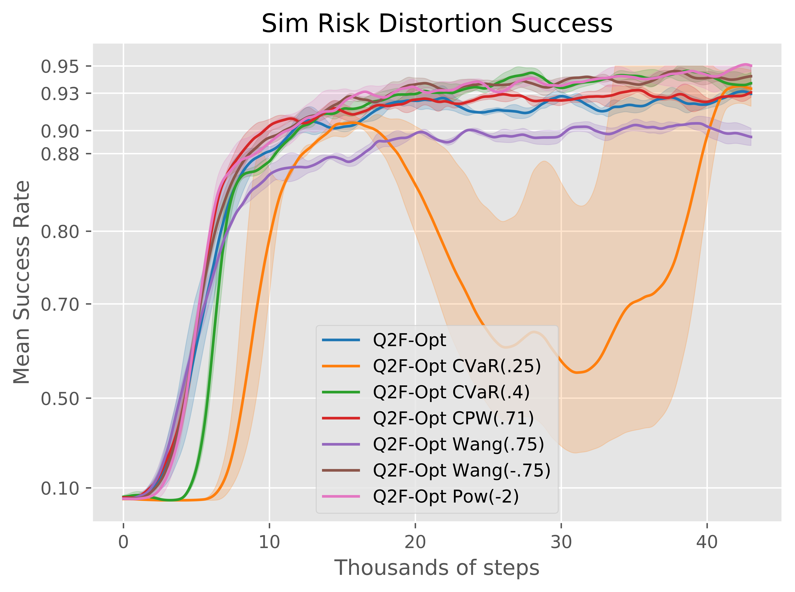
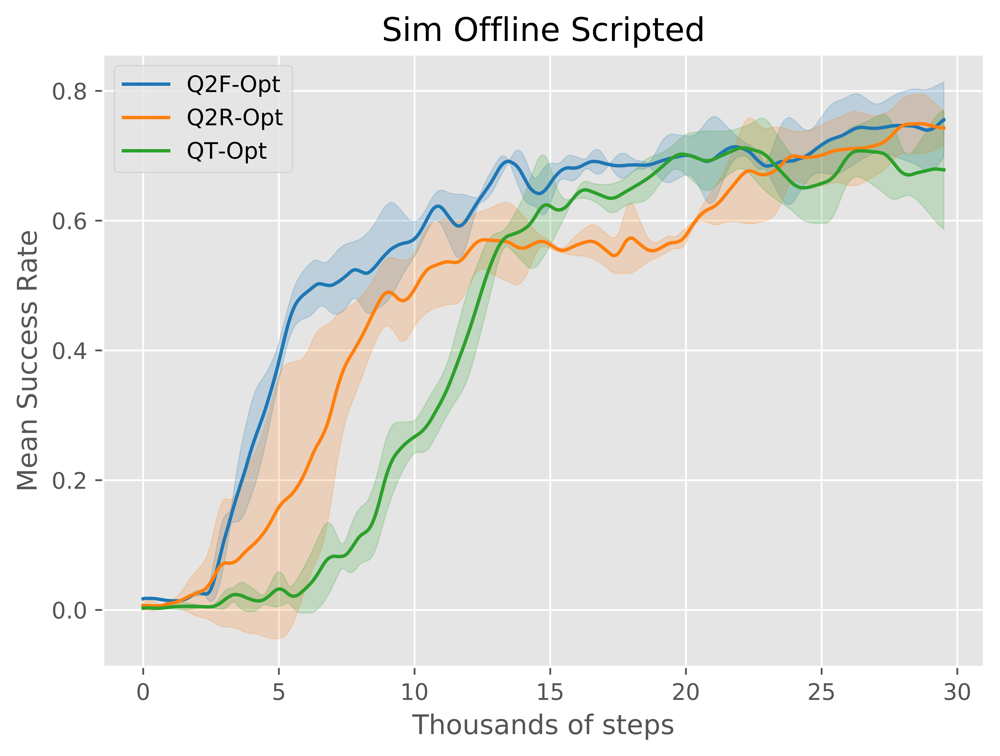

## Abstract
The distributional perspective on reinforcement learning (RL) has given
rise to a series of successful Q-learning algorithms, resulting in
state-of-the-art performance in arcade game environments. However, it
has not yet been analyzed how these findings from a discrete setting
translate to complex practical applications characterized by noisy, high
dimensional and continuous state-action spaces. In this work, we propose
**Quantile QT-Opt (Q2-Opt)**, a *distributional* variant of the recently
introduced distributed Q-learning algorithm
for continuous domains, and examine its behaviour in a series of
simulated and real vision-based robotic grasping tasks. The absence of
an actor in Q2-Opt allows us to directly draw a parallel to the previous
discrete experiments in the literature without the additional
complexities induced by an actor-critic architecture. We demonstrate
that Q2-Opt achieves a superior vision-based object grasping success
rate, while also being more sample efficient. The distributional
formulation also allows us to experiment with various risk distortion
metrics that give us an indication of how robots can concretely manage
risk in practice using a Deep RL control policy. As an additional
contribution, we perform batch RL experiments in our virtual environment
and compare them with the latest findings from discrete settings.
Surprisingly, we find that the previous batch RL findings from the
literature obtained on arcade game environments do not generalise to our
setup.

[here]: https://q2-opt.github.io

______

<figcaption>
Figure 1. Distributed system architecture of Q2-Opt. The interactions between the robot and the environment are either stored in a database of episodes for later offline learning, or they are directly sent to the replay buffer when online learning is performed. The samples from the Simulation Buffer are pulled by the Bellman Updater, which appends the distributional targets. These labelled transitions are pushed to the train buffer and consumed by the TPU Training workers to compute the gradients. The parameter server uses the gradients to update the weights, which are asynchronously pulled by the agents.
</figcaption>

## Introduction

The new distributional perspective on RL has produced a novel class of
Deep Q-learning methods that learn a distribution over the state-action
returns, instead of using the expectation given by the traditional value
function. These methods, which obtained state-of-the-art results in the
arcade game environments  <dt-cite key="bellemare2017distributional,dabney2018distributional,dabney2018implicit"></dt-cite>, 
present several attractive properties.

First, their ability to preserve the multi-modality of the action values
naturally accounts for learning from a non-stationary policy, most often
deployed in a highly stochastic environment. This ultimately results in
a more stable training process and improved performance and sample
efficiency. Second, they enable the use of risk-sensitive policies that
no longer select actions based on the expected value, but take entire
distributions into account. These policies can represent a continuum of
risk management strategies ranging from risk-averse to risk-seeking by
optimizing for a broader class of risk metrics. 

Despite the improvements distributional Q-learning algorithms
demonstrated in the discrete arcade environments, it is yet to be
examined how these findings translate to practical, real-world
applications. Intuitively, the advantageous properties of distributional
Q-learning approaches should be particularly beneficial in a robotic
setting. The value distributions can have a significant qualitative
impact in robotic tasks, usually characterized by highly-stochastic and
continuous state-action spaces. Additionally, performing safe control in
the face of uncertainty is one of the biggest impediments to deploying
robots in the real world, an impediment that RL methods have not yet
tackled. In contrast, a distributional approach can allow robots to
learn an RL policy that appropriately quantifies risks for the task of
interest.

However, given the brittle nature of deep RL algorithms and their often
counter-intuitive behaviour <dt-cite key="Henderson2017DeepRL"></dt-cite>, 
it is not entirely clear if these intuitions would hold in practice. Therefore, we believe
that an empirical analysis of distributional Q-learning algorithms in
real robotic applications would shed light on their benefits and
scalability, and provide essential insight for the robot learning
community.

In this paper, we aim to address this need and perform a thorough
analysis of distributional Q-learning algorithms in simulated and real
vision-based robotic manipulation tasks. To this end, we propose a
distributional enhancement of QT-Opt <dt-cite key="kalashnikov2018scalable"></dt-cite> 
subbed
Quantile QT-Opt (Q2-Opt). The choice of QT-Opt, a recently introduced
distributed Q-learning algorithm that operates on continuous action
spaces, is dictated by its demonstrated applicability to large-scale
vision-based robotic experiments. In addition, by being an actor-free
generalization of Q-learning in continuous action spaces, QT-Opt enables
a direct comparison to the previous results on the arcade environments
without the additional complexities and compounding effects of an
actor-critic-type architecture.

In particular, we introduce two versions of Q2-Opt, based on Quantile Regression DQN (QR-DQN) <dt-cite key="dabney2018distributional"></dt-cite> and Implicit Quantile Networks (IQN) <dt-cite key="dabney2018implicit"></dt-cite>. The two methods are
evaluated on a vision-based grasping task in simulation and the real
world. We show that these distributional algorithms achieve
state-of-the-art grasping success rate in both settings, while also
being more sample efficient. Furthermore, we experiment with a multitude
of risk metrics, ranging from risk-seeking to risk-averse, and show that
risk-averse policies can bring significant performance improvements. We
also report on the interesting qualitative changes that different risk
metrics induce in the robots' grasping behaviour. As an additional
contribution, we analyze our distributional methods in a batch RL
scenario and compare our findings with an equivalent experiment from the
arcade environments <dt-cite key="Agarwal2019StrivingFS"></dt-cite>.

## Related Work

Deep learning has shown to be a useful tool for learning visuomotor
policies that operate directly on raw images. Examples include various
manipulation tasks, where related approaches use either supervised
learning to predict the probability of a successful
grasp <dt-cite key="mahler2017dex,levine2016end,Pinto2015SupersizingSL"></dt-cite> 
or learn a reinforcement-learning control policy <dt-cite key="levine2018learning,quillen2018deep,kalashnikov2018scalable"></dt-cite>.

Distributional Q-learning algorithms have been so far a separate line of
research, mainly evaluated on game environments. These algorithms
replace the expected return of an action with a distribution over the
returns and mainly vary by the way they parametrize this distribution.
Bellemare et al. <dt-cite key="bellemare2017distributional"></dt-cite> 
express it as a
categorical distribution over a fixed set of equidistant points. Their
algorithm, C51, minimizes the KL-divergence to the projected
distributional Bellman target. A follow-up algorithm, QR-DQN <dt-cite key="dabney2018distributional"></dt-cite>
, approximates the distribution by learning the outputs of the quantile function at a fixed set of points, the quantile midpoints. This latter approach has been extended by IQN <dt-cite key="dabney2018implicit"></dt-cite>, 
which reparametrized the critic network to take
as input any probability $\tau$ and learn the quantile function itself.
Besides this extension, their paper also analyses various risk-sensitive
policies that the distributional formulation enables. In this work, we
apply these advancements to a challenging vision-based real-world
grasping task with a continuous action-space.

Closest to our work is D4PG <dt-cite key="barth2018distributed"></dt-cite>, a distributed and distributional version of DDPG <dt-cite key="Lillicrap2015ContinuousCW"></dt-cite> that
achieves superior performance to the non-distributional version in a
series of simulated continuous-control environments. In contrast to this
work, we analyze a different variant of Q-learning with continuous
action spaces, which allows us to focus on actor-free settings that are
similar to the previous distributional Q-learning algorithms. Besides,
we demonstrate our results on real robots on a challenging vision-based
grasping task.

## Background

As previously stated, we build our method on top of
QT-Opt <dt-cite key="kalashnikov2018scalable"></dt-cite>, a distributed Q-learning algorithm
suitable for continuous action spaces. QT-Opt is one of the few scalable
deep RL algorithms with demonstrated generalisation performance in a
challenging real-world task. As the original paper shows, it achieves an
impressive 96% vision-based grasp success rate on unseen objects.
Therefore, building on top of QT-Opt is a natural choice for evaluating
value distributions on a challenging real-world task, beyond simulated
environments. Additionally, by directly generalising Q-Learning to
continuous domains, QT-Opt allows us to compare our results with the
existing distributional literature on discrete environments.

In this paper, we consider a standard Markov Decision Process
<dt-cite key="Puterman1994MarkovDP"></dt-cite> formulation
$(\mathcal{S}, \mathcal{A}, r, p, \gamma)$, where $s \in \mathcal{S}$
and $a \in \mathcal{A}$ denote the state and action spaces, $r(s, a)$ is
a deterministic reward function, $p(\cdot|s, a)$ is the transition
function and $\gamma \in (0, 1)$ is the discount factor. QT-Opt trains a
parameterized state-action value function $Q_\theta(s, a)$ which is
represented by a neural network with parameters $\theta$. The
cross-entropy method (CEM) <dt-cite key="Rubinstein2004TheCM"></dt-cite>  is used to iteratively
optimize and select the best action for a given Q-function:

$$\pi_\theta(s)=\mathrm{arg\,max}_{a}Q_\theta(s,a)$$

In order to train the Q-function, a separate process called the "Bellman
Updater" samples transition tuples $(s,a,r,s')$ containing the state
$s$, action $a$, reward $r$, and next state $s'$ from a replay buffer
and generates Bellman target values according to a clipped Double
Q-learning rule <dt-cite key="Hasselt2010DoubleQ,Sutton:1998:IRL:551283"></dt-cite>:

$$\hat{Q}(s,a,r,s')=r+\gamma V(s')$$
$$\hat{Q}(s, a, s') = r(s,a)+\gamma V(s'),$$

where $V(s')=Q_{\bar{\theta_1}}(s',\pi_{\bar{\theta_2}}(s'))$, and 
$\bar{\theta_1}$ and $\bar{\theta_2}$ are the parameters of two delayed
target networks. These target values are pushed to another replay buffer
$\mathcal{D}$, and a separate training process optimizes the Q-function
against a training objective:

$$\mathcal{E}(\theta)=\mathbb{E}_{(s,a,s')\sim\mathcal{D}}\left[D(Q_\theta(s,a),\hat{Q}(s, a, s'))\right],$$

where $D$ is a divergence metric.

In particular, the cross-entropy loss is chosen for $D$, and the output
of the network is passed through a sigmoid activation to ensure that the
predicted Q-values are inside the unit interval.

## Quantile QT-Opt (Q2-Opt)

In Q2-Opt (Figure 1) the value function no longer
predicts a scalar value, but rather a vector $\mathbf{q}_\theta(s,a, \mathbf{\tau})$
that predicts the quantile function output for a vector of input
probabilities $\mathbf{\tau}$, with $\mathbf{\tau}_i \in [0, 1]$ and $i=1,\ldots,N$.
Thus the $i$-th element of $\mathbf{q}_i(s,a, \mathbf{\tau})$ approximates $F^{-1}_{s, a}(\mathbf{\tau}_i)$, where
$F_{s, a}$ is the CDF of the value distribution belonging to the state
action pair $(s, a)$. In practice, this means that the neural network
has a multi-headed output. However, unlike QT-Opt where CEM optimizes
directly over the Q-values, in Quantile QT-Opt, CEM maximizes a scoring
function $\psi: {\mathbb{R}}^N \to {\mathbb{R}}$ that maps the vector
$\mathbf{q}$ to a score $\psi(\mathbf{q})$:

$$\pi_\theta(s, \mathbf{\tau})=\mathrm{arg\,max}_{a}\psi(\mathbf{q}_\theta(s,a, \mathbf{\tau}))$$

Similarly, the target values produced by the “Bellman updater” are
vectorized using a generalization of the clipped Double Q-learning rule
from QT-Opt: 

$$\hat{\mathbf{q}}(s, a, s', \tau', \tau'') = r(s,a)\mathbf{1}+\gamma\mathbf{v}(s', \tau, \tau')$$
$$\mathbf{v}(s', \tau, \tau') = \mathbf{q}_{\bar{\theta}_1}(s',\pi_{\bar{\theta}_2}(s', \tau''), \tau')$$ 

where $\vone$ is a vector of ones, and, as before, $\bar{\theta}_1$ and $\bar{\theta}_2$ are the parameters of two delayed target networks. Even though this update rule has not been considered so far in the distributional RL literature, we find it  effective in reducing the overestimation in the predictions. 

In the following sections, we present two versions of Q2-Opt based on two recently introduced distributional algorithms: QR-DQN and IQN. The main differences between them arise from the inputs $\tau, \tau'$, and $\tau''$ that are used. To avoid overloading our notation, from now on we omit the parameter subscript in $\mathbf{q}_\theta, \hat{\mathbf{q}}_{\hat{\theta}}$ and replace it with an index into these vectors $\mathbf{q}_i, \hat{\mathbf{q}}_j$.

**Quantile Regression QT-Opt (Q2R-Opt)**

In Quantile Regression QT-Opt (Q2R-Opt), the vectors $\tau, \tau', \tau''$ in $\mathbf{q}$ and $\hat{\mathbf{q}}$ are fixed. They all contain $N$ quantile midpoints of the value distribution. Concretely, $\mathbf{q}_i(s,a,\tau)$ is assigned the fixed quantile target $\tau_i = \frac{\bar{\tau}_{i-1} + \bar{\tau}_{i}}{2}$ with $\bar{\tau}_i = \frac{i}{N}$. The scoring function $\psi(\cdot)$ takes the mean of this vector, reducing the $N$ quantile midpoints to the expected value of the distribution. Because $\tau, \tau', \tau''$ are always fixed we consider them implicit and omit adding them as an argument to $\mathbf{q}$ and $\hat{\mathbf{q}}$ for Q2R-Opt.

The quantile heads are optimized by minimizing the Huber <dt-cite key="huber1964"></dt-cite>
quantile regression loss: 

$$\rho_\tau^\kappa(\delta_{ij}) = |\tau - \mathbb{I}\{\delta_{ij} < 0\}| \frac{\mathcal{L}_\kappa(\delta_{ij})}{\kappa}$$

$$
\mathcal{L}_\kappa(\delta_{ij}) = 
\begin{cases}
    \frac{1}{2} \delta_{ij}^2, & \text{if } |\delta_{ij}| \leq \kappa \\ 
    \kappa (|\delta_{ij}| - \frac{1}{2}\kappa),   & \text{otherwise} 
\end{cases}
$$
for all the pairwise TD-errors:
$$\delta_{ij} = \hat{\mathbf{q}}_j(s,a,s') - \mathbf{q}_i(s, a)$$ 

Thus, the network is trained to minimize the loss function: 

$$\mathcal{E}(\theta)={\mathbb{E}}_{(s,a,s')\sim\mathcal{D}}\left[\sum_{i=1}^N {\mathbb{E}}_j[\rho_{\hat{\tau}_i}^\kappa(\delta_{ij})]\right]$$

We set $\kappa$, the threshold between the quadratic and linear regime
of the loss, to $0.002$ across all of our experiments.

**Quantile Function QT-Opt (Q2F-Opt)**

In Q2F-Opt, the neural network itself approximates the quantile function of the value distribution, and therefore it can predict the inverse CDF for any $tau$. Since $\tau, \tau', \tau''$ are no longer fixed, we explicitly include them in the arguments of $\mathbf{q}$ and $\hat{\mathbf{q}}$. Thus, the TD-errors $\delta_{ij}$ take the form:

$$\delta_{ij} = \hat{\mathbf{q}}_j(s, a, s', \mathbf{\tau}', \tau'') - \mathbf{q}_i(s, a, \mathbf{\tau}),$$

where $\tau_i \sim U[0, 1]$, $\tau'_j \sim U[0, 1]$ and $\tau''_j \sim U[0, 1]$ are sampled from independent uniform distributions. Using different input probability vectors also decreases the correlation between the networks. Note that now the length of the prediction and target vectors are determined by the lengths of $\tau$ and $\tau'$. The model is optimized using the same loss function as Q2R-Opt.

**Risk-Sensitive Policies**

The additional information provided by a value distribution compared to the (scalar) expected return gives birth to a broader class of policies that go beyond optimizing for the expected value of the actions. Concretely, the expectation can be replaced with any risk metric, that is any function that maps the random return to a scalar quantifying the risk. In Q2-Opt, this role is played by the function $\psi$ that acts as a risk-metric. Thus the agent can handle the intrinsic uncertainty of the task in different ways depending on the specific form of $\psi$. It is important to specify that this uncertainty is generated by the environment dynamics ($p$) and the (non-stationary) policy collecting the real robot rollouts and that it is not a parametric uncertainty. 

We distinguish two methods to construct risk-sensitive policies for Q2R-Opt and Q2F-Opt, each specific to one of the methods. In Q2R-Opt, risk-averse and risk-seeking policies can be obtained by changing the function $\psi(\cdot)$ when selecting actions. Rather than computing the mean of the target quantiles, $\psi(\cdot)$ can be defined as a weighted average over the quantiles $\psi(\mathbf{q}(s,a)) = \frac{1}{N} \sum w_i \mathbf{q}_i(s,a)$. This sum produces a policy that is in between a worst-case and best-case action selector and, for most purposes, it would be preferable in practice over the two extremes. For instance, a robot that would consider only the worst-case scenario would most likely terminate immediately since this strategy, even though it is not useful, does not incur any penalty. Behaviours like this have been encountered in our evaluation of very conservative policies.

In contrast, Q2F-Opt provides a more elegant way of learning risk-sensitive control policies by using risk-distortion metrics <dt-cite key="wang_1996"></dt-cite>. Recently, Majmidar and Pavone  <dt-cite key="Majumdar2017HowSA"></dt-cite> have argued for the use of risk distortion metrics in robotics. They proposed a set of six axioms that any risk measure should meet to produce reasonable behaviour and showed that risk distortion metrics satisfy all of them. However, to the best of our knowledge, they have not been tried
on real robotic applications.

The key idea is to use a policy:

$$\pi_\theta(s, \beta(\tau)) = \mathrm{arg\,max}_a \psi(\mathbf{q}(s,a, \beta(\mathbf{\tau}))),$$

where $\beta: [0, 1] \to [0, 1]$ is an element-wise function that
distorts the uniform distribution that ${\tau}$ is effectively
sampled from, and $\psi(\cdot)$ computes the mean of the vector as
usual. Functions $\beta$ that are concave induce risk-averse policies,
while convex function induce risk-seeking policies.

<figcaption>

Table 1. The considered risk distortion metrics.

</figcaption>

In our experiments, we consider the same risk distortion metrics used by
Dabney et al. <dt-cite key="dabney2018implicit"></dt-cite>: the cumulative probability
weighting (**CPW**) <dt-cite key="Gonzlez1999OnTS"></dt-cite>, the standard normal CDF-based
metric proposed by **Wang** <dt-cite key="Wang00aclass"></dt-cite>, the conditional value at
risk (**CVaR**) <dt-cite key="Rockafellar00optimizationof"></dt-cite>,
**Norm** <dt-cite key="dabney2018implicit"></dt-cite>, and a power law formula
(**Pow**) <dt-cite key="dabney2018implicit"></dt-cite>. Concretely, we use these metrics with a
parameter choice similar to that of Dabney et al. <dt-cite key="dabney2018implicit"></dt-cite>. CPW(0.71) is known to be a good model
human behaviour <dt-cite key="Wu1996"></dt-cite>, Wang$(-.75)$, Pow$(-2)$, CVaR$(0.25)$ and CVaR$(0.4)$ are risk-averse. Norm($3$) decreases the weight of the distribution's tails by averaging 3 uniformly sampled $\tau$. Ultimately, Wang$(.75)$ produces
risk-seeking behaviour. We include all these metrics in Table 1. 

Due to the relationships between Q2F-Opt and the literature of risk
distortion measures, we focus our risk-sensitivity experiments on the
metrics mentioned above and leave the possibility of trying different
functions $\psi(\cdot)$ in Q2R-Opt for future work.

**Model Architecture**

<figcaption>
Figure 2. The neural network architectures for QT-Opt (yellow), Q2R-Opt (green) and Q2F-Opt (red). The common components of all the three models are represented by black arrows. The top-left image shows a view from the robot camera inside our simulation environment.
</figcaption>

To maintain our comparisons with QT-Opt, we use very similar
architectures for Q2R-Opt and Q2F-Opt. For Q2R-Opt, we modify the output
layer of the standard QT-Opt architecture to be a vector of size
$N = 100$, rather than a scalar. For Q2F-Opt, we take a similar approach
to Dabney et al. <dt-cite key="dabney2018implicit"></dt-cite>, and embed every ${\tau}_k$ with
$k \in \{1, \ldots, N = 32\}$ using a series of $n = 64$ cosine basis
functions:

$$\phi_j(\tau_k) := \text{ReLU}\left(\sum_{i=0}^{n-1} \cos(\pi i \tau_k)w_{ij} + b_j\right)$$

We then perform the Hadamard product between this embedding and the convolutional features. 
Another difference in Q2F-Opt is that we replace batch normalization 
<dt-cite key="Ioffe:2015:BNA:3045118.3045167"></dt-cite> 
in the final fully-connected layers with layer normalization 
<dt-cite key="Ba2016LayerN"></dt-cite>. 
We notice that this better keeps the sampled values in the range allowed by our
MDP formulation. The three architectures are all included in a single diagram in Figure 2. 

## Results

In this section, we present our results on simulated and real
environments. In simulation, we perform both online and offline
experiments, while for the real world, the training is exclusively
offline. We begin by describing our evaluation method.

**Experimental Setup**

We consider the problem of vision-based robotic grasping for our
evaluations. In our grasping setup, the robot arm is placed at a fixed
distance from a bin containing a variety of objects and tasked with
grasping any object. The MDP specifying our robotic manipulation task
provides a simple binary reward to the agent at the end of the episode:
$0$ for a failed grasp, and $1$ for a successful grasp. To encourage the
robot to grasp objects as fast as possible, we use a time step penalty
of $-0.01$ and a discount factor $\gamma=0.9$. The state is represented
by a $472\times472$ RGB image; the actions are a mixture of continuous
4-DOF tool displacements in $x$, $y$, $z$ with azimuthal rotation
$\phi$, and discrete actions to open and close the gripper, as well as
to terminate the episode.

In simulation, we grasp from a bin containing 8 to 12 randomly generated 
procedural objects (Figure 2). For the first $5,000$ global training
steps, we use a procedural exploration policy. The scripted policy is
lowering the end effector at a random position at the level of the bin
and attempts to grasp. After $5,000$ steps, we switch to an
$\epsilon$-greedy policy with $\epsilon = 0.2$. We train the network
from scratch (no pretraining) using Adam <dt-cite key="kingma2014adam"></dt-cite> with a
learning rate $10^{-4}$ and batch size $4096$ ($256$ per chip on a
$4\times4$ TPU). Additionally, we use two iterations of CEM with 64
samples for each. 

In the real world, we train our model offline from a $72$ TiB dataset of
real-world experiences collected over five months, containing $559,642$
episodes of up to $20$ time steps each. Out of these, $39\%$ were
generated by noise-free trained QT-Opt policies, $22\%$ by an
${\epsilon}$-greedy strategy using trained QT-Opt policies and $39\%$ by
an ${\epsilon}$-greedy strategy based on a scripted policy. For
evaluation, we attempt 6 consecutive grasps from a bin containing 6
objects without replacement, repeated across 5 rounds. Figures 2 and 3 
include our workspace setup. We perform
this experiment in parallel on 7 robots, resulting in a total of $210$
grasp attempts. All the robots use a similar object setup consisting of
two plastic bottles, one metal can, one paper bowl, one paper cup, and
one paper cup sleeve. In the results section, we report the success rate
over the $210$ attempts. 

Our evaluation methodology is different from that of Kalashnikov et al.
<dt-cite key="kalashnikov2018scalable"></dt-cite>. The original QT-Opt paper reports an average
success rate of 76% for grasping 28 objects over 30 attempts without
replacement, trained on a mixture of off-policy and on-policy data.
While not directly comparable, we reproduce QT-Opt on a completely
different robot with different objects and report an average success
rate of 70% for grasping 6 objects over 6 attempts without replacement,
trained on off-policy data only.

**Simulation Experiments**

<figcaption>
Figure 3. Sim success rate as a function of the global step. The distributional
methods achieve higher grasp success rates in a lower number of global
steps.
</figcaption>

We begin by evaluating Q2-Opt against QT-Opt in simulation.
Figure. Figure 3 shows the mean success rate as a function
of the global training step together with the standard deviation across
five runs for QT-Opt, Q2R-Opt and Q2F-Opt. Because Q2-Opt and QT-Opt are
distributed systems, the global training step does not directly match
the number of environment episodes used by the models during training.
Therefore, to understand the sample efficiency of the algorithm, we also
include in Figure 4 the success rate as a function of
the total number of environment episodes added to the buffer.

<figcaption>

Figure 4. Sim success rate as a function of the number of generated environment
episodes. The distributional methods are significantly more sample
efficient than QT-Opt.

</figcaption>

The distributional methods achieve higher success rates while also being
more sample efficient than QT-Opt. While Q2F-Opt performs best, Q2R-Opt
exhibits an intermediary performance and, despite being less sample
efficient than Q2F-Opt, it still learns significantly faster than our
baseline.

<figcaption>

Table 2. Final sim success rate statistics. Distributional 
risk-averse policies have the best performance.

</figcaption>

We extend these simulation experiments with a series of risk distortion
measures equipped with different parameters. Figure 5 shows the success rate for various
measures used in Q2F-Opt. We notice that risk-averse policies
(Wang$(-0.75)$, Pow$(-2)$, CVaR) are generally more stable in the late
stages of training and achieve a higher success rate. Pow$(-2)$
remarkably achieves 95% grasp success rate. However, being too
conservative can also be problematic. Particularly, the CVaR$(0.25)$
policy becomes more vulnerable to the locally optimal behaviour of
stopping immediately (which does not induce any reward penalty). This
makes its performance fluctuate throughout training, even though it
ultimately obtains a good final success rate. 
Table 2 gives the complete final success rate statistics. 

<figcaption>

Figure 5. Average success rate over five runs for different risk-sensitive
policies in sim. Most risk averse policies perform better, but extremely
conservative ones like CVaR(.25) can become unstable. The risk-seeking
policy Wang(.75) performs worse than the others. 

</figcaption>

**Real-World Experiments**

<figcaption>

Table 3. Real world grasp success rate out of 210 total grasps. 
Our methods significantly outperform QT-Opt, 
while risk-averse polices are better by a significant margin.

</figcaption> 

The chaotic physical interactions specific to real-world environments
and the diversity of policies used to gather the experiences make the
real environment an ideal setting for distributional RL. Furthermore,
this experiment is also of practical importance for robotics since any
increase in grasp success rate from offline data reduces the amount of
costly online training that has to be performed to obtain a good policy.

<video class="b-lazy" data-src="assets/mp4/qr_pull_center.mp4" type="video/mp4" autoplay muted playsinline loop style="display: block; width: 60%;"></video>
<figcaption>
Q2R-Opt learns to pull the can from the corner of the bin to a more central position from where it is easier to grasp.
</figcaption>

We report in Table 3 the grasp success rate statistics for all
the considered models. We find that the best risk-averse version of
Q2-Opt achieves an impressive 17.6% higher success rate than QT-Opt.
While the real evaluation closely matches the model hierarchy observed
in sim, the success rate differences between the models are much more
significant. 

<video class="b-lazy" data-src="assets/mp4/wang_n_paper_certain.mp4" type="video/mp4" autoplay muted playsinline loop style="display: block; width: 60%;"></video>
<figcaption>
Risk-averse Q2F-Opt Wang(-0.75) performing active perception. The agent needs to move the end effector arround to realise that it grasped the object.
</figcaption>

Besides the improvement in performance, we notice that the distortion
measures of Q2F-Opt have a significant qualitative impact, even though
the training is performed from the same data. Risk-averse policies tend
to readjust the gripper in positions that are more favourable or move
objects around to make grasping easier. CVaR(0.4), the most conservative
metric we tested in the real world, presented a particularly interesting
behaviour of intentionally dropping poorly grasped objects to attempt a
better re-grasp. 

<video class="b-lazy" data-src="assets/mp4/cvar_can_bin_edge.mp4" type="video/mp4" autoplay muted playsinline loop style="display: block; width: 60%;"></video>
<figcaption>
CVaR (risk-averse) policy learns to use the edges of the bin to get a better grip of the object and reduce the uncertainty.
</figcaption>

The CVaR policy mainly used this technique when
attempting to grasp objects from the corners of the bin to move them in
a central position.  However, a downside of risk-averse policies that we noticed is that, for
the difficult-to-grasp paper cup sleeves, the agent often kept searching
for an ideal position without actually attempting to grasp. We believe
this is an interesting example of the trade-offs between being
conservative and risk-seeking. 

<video class="b-lazy" data-src="assets/mp4/wang_n_uncertain.mp4" type="video/mp4" autoplay muted playsinline loop style="display: block; width: 60%;"></video>
<figcaption>
Risk-averse policies can sometimes be too conservative and avoid attempting a grasp even in promising positions.
</figcaption>

The only tested risk-seeking policy,
using Wang(0.75), made many high-force contacts with the bin and
objects, which often resulted in broken gripper fingers and objects
being thrown out of the bin.  

<video class="b-lazy" data-src="assets/mp4/wang_p_bottle.mp4" type="video/mp4" autoplay muted playsinline loop style="display: block; width: 60%;"></video>
<figcaption>
Risk-seeking Wang(0.75) is more sloppy. After multiple attempts it succeeds to grasp the bottle but it does not get a good grip of it. 
</figcaption>

These qualitative differences in behaviour that value distributions
cause can provide a way to achieve safe robot control. An interesting
metric we considered to quantify these behaviours is the number of
broken gripper fingers throughout the entire evaluation process
presented above. Occasionally, the gripper fingers break in high-force
contacts with the objects or the bin. Figure 6 plots these numbers for each policy.
Even though we do not have a statistically significant number of
samples, we believe this figure is a good indicator that risk-averse
policies implicitly achieve safer control.

<figcaption>

Figure 6. The number of detached gripper fingers during evaluation. Among the risk-averse policies (first three), only one gripper broke. The agents controlled by risk-neutral policies (Q2R-Opt, Q2F-Opt, QT-Opt) lost eight gripper fingers in total, with half of those belonging to QT-Opt. The last policy, which is risk-seeking lost four, similar to QT-Opt. The other policies (Norm, CPW) behaved similarly to risk-neutral policies.

</figcaption>

**Batch RL and Exploitation**

Recently, Agarwal et al. <dt-cite key="Agarwal2019StrivingFS"></dt-cite> have argued that most
of the advantages of distributional algorithms come from better
exploitation. Their results demonstrated that QR-DQN could achieve in
offline training a performance superior to online C51. Since environment
interactions are particularly costly in robotics, we aim to reproduce
these results in a robotic setting. Therefore, we perform an equivalent
experiment in simulation and train the considered models on all the
transitions collected during training by a QT-Opt agent with a final
success rate of 90% (Figure 7a).

<figcaption>

Figure 7a. Sim off-policy success rate for data collected during a full training run. 
None of the methods can achieve the final performance of the policy trained online (90\%).

</figcaption>

We note that despite the minor success rate improvements brought by
Q2R-Opt and Q2F-Opt, the two models are not even capable of achieving
the final success rate of the policy trained from the same data. We
hypothesize this is due to the out-of-distribution action
problem <dt-cite key="Kumar2019StabilizingOQ"></dt-cite>, which becomes more prevalent in
continuous action spaces.

<figcaption>

Figure 7b. Sim success rate from an offline dataset produced by a 
scripted exploration policy. The models achieve a higher 
success rate than on the replay buffer dataset..

</figcaption>

We investigated this further on two other datasets: one collected by a
scripted stochastic exploration policy with $46\%$ success rate and
another produced by an almost optimal policy with $89\%$ grasp success
rate. Figures 7b and 7c plot the results for these two datasets.
Surprisingly, the models achieve a higher success rate on the scripted
exploration dataset than on the dataset collected during training. On
the dataset generated by the almost optimal policy, none of the methods
manages to obtain a reasonable success rate. These results, taken
together with our real-world experiments, suggest that offline datasets
must contain a diverse set of experiences to learn effectively in a
batch RL setting.

<figcaption>

Figure 7c. Sim success rate from an offline dataset produced by a policy 
close to optimality. None of the models is able to learn from a 
dataset of successful grasps.

</figcaption>

## Conclusion

In this work, we have examined the impact that value distributions have
on practical robotic tasks. Our proposed methods, collectively called
Q2-Opt, achieved state-of-the-art success rates on simulated and real
vision-based robotic grasping tasks, while also being significantly more
sample efficient than the non-distributional equivalent, QT-Opt.
Additionally, we have shown how safe reinforcement learning control can
be achieved through risk-sensitive policies and reported the rich set of
behaviours these policies produce in practice despite being trained from
the same data. As a final contribution, we evaluated the proposed
distributional methods in a batch RL setting similar to that of Agarwal
et al. <dt-cite key="Agarwal2019StrivingFS"></dt-cite> and showed that, 
unfortunately, their findings do not translate to the continuous grasping 
environment presented in this work.

## Acknowledgments 

We would like to give special thanks to Ivonne Fajardo and Noah Brown
for overseeing the robot operations. We would also like to extend our
gratitude to Julian Ibarz for helpful comments.